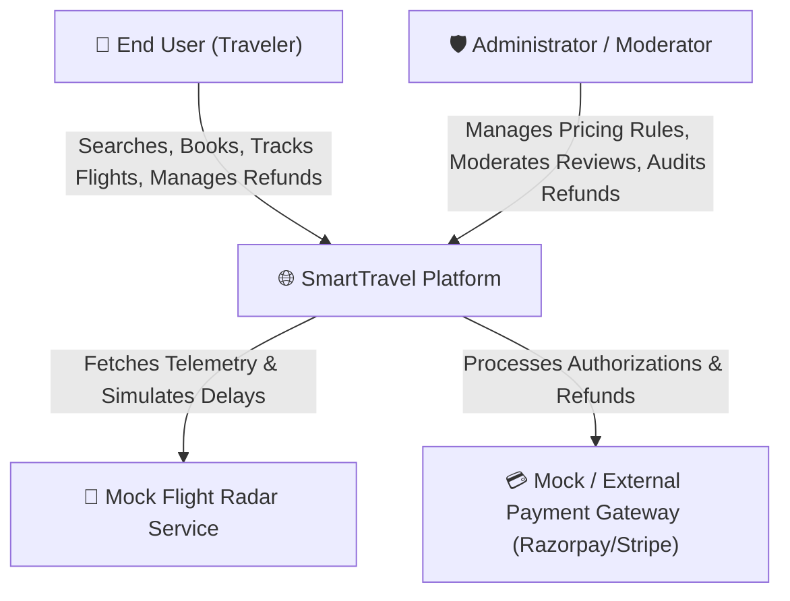
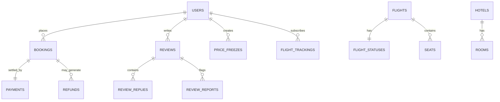
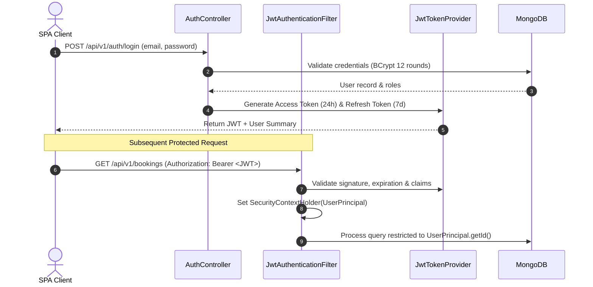
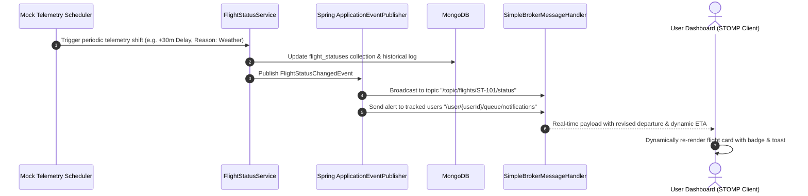
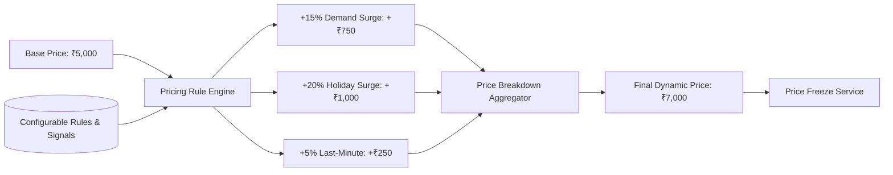
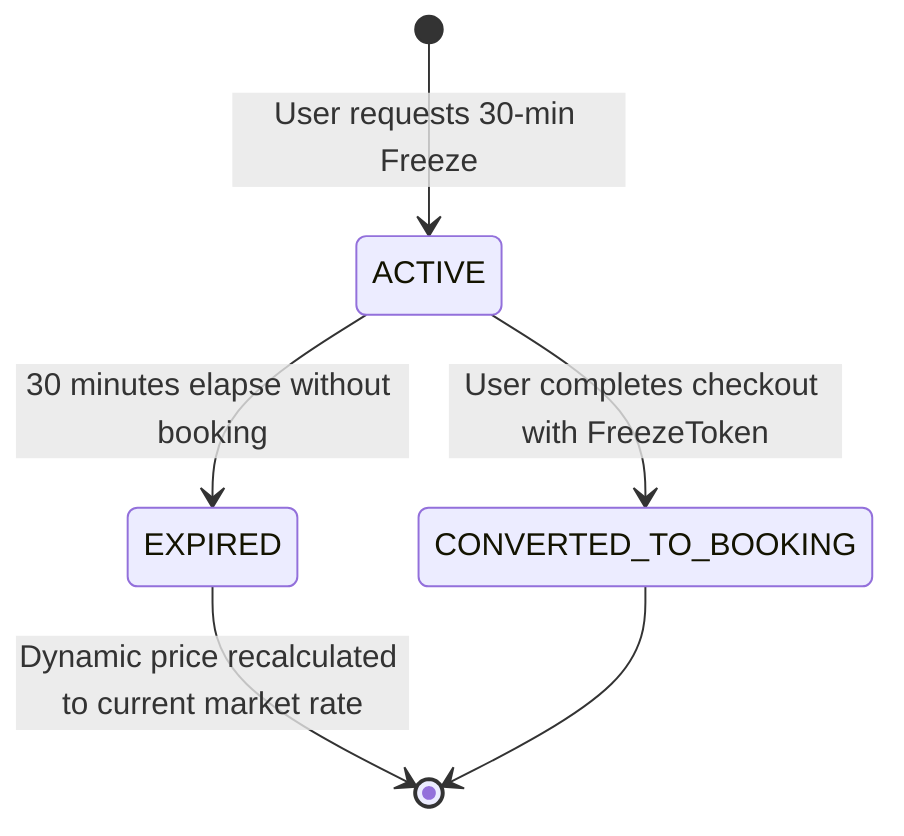
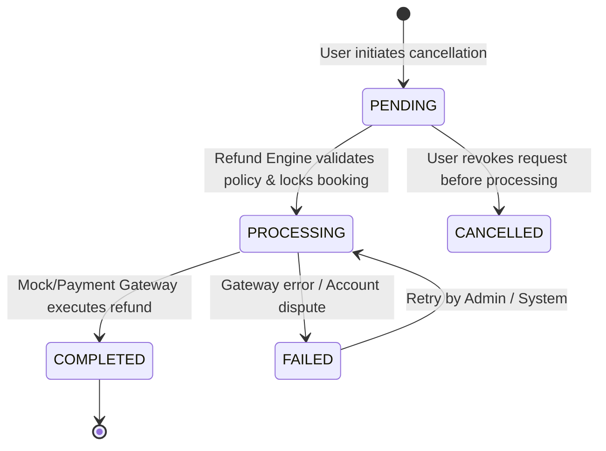
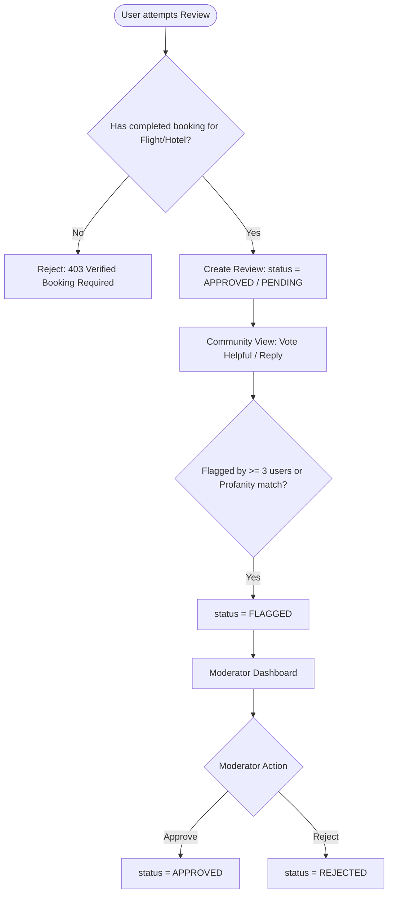
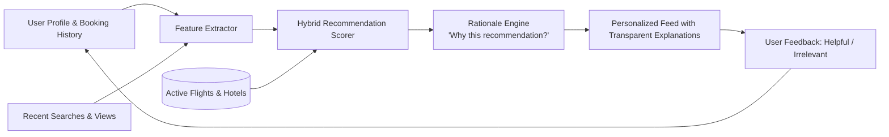

# SmartTravel Platform — Architectural Specification

> **Version:** 1.0.0-PROD-ARCH  
> **Status:** Approved / Foundation Stage  
> **Target Audience:** Engineering Team, Tech Leads, QA Engineers, Security Reviewers  

---

## Table of Contents

1. [Executive Summary & Architectural Principles](#1-executive-summary--architectural-principles)
2. [System Context & Container Architecture](#2-system-context--container-architecture)
3. [Technology Stack & Decision Matrix (ADRs)](#3-technology-stack--decision-matrix-adrs)
4. [Backend Modular Architecture & Package Structure](#4-backend-modular-architecture--package-structure)
5. [Database Architecture & MongoDB Collection Design](#5-database-architecture--mongodb-collection-design)
6. [Security Architecture & Zero-Trust Design](#6-security-architecture--zero-trust-design)
7. [Real-Time Flight Tracking Architecture](#7-real-time-flight-tracking-architecture)
8. [Dynamic Pricing & Price Freeze Engine](#8-dynamic-pricing--price-freeze-engine)
9. [Cancellation & Refund Engine](#9-cancellation--refund-engine)
10. [Seat & Room Inventory Management Architecture](#10-seat--room-inventory-management-architecture)
11. [Review, Rating & Moderation System](#11-review-rating--moderation-system)
12. [Personalized Recommendation Engine](#12-personalized-recommendation-engine)
13. [Frontend Single-Page Application (SPA) Architecture](#13-frontend-single-page-application-spa-architecture)
14. [Cross-Cutting Concerns & Error Handling](#14-cross-cutting-concerns--error-handling)

---

## 1. Executive Summary & Architectural Principles

The **SmartTravel Platform** is an enterprise-grade, API-first travel ecosystem designed to handle end-to-end flight and hotel bookings, dynamic algorithmic pricing, real-time telemetry updates, tiered automated refunds, interactive seat/room selection, moderated reviews, and hybrid recommendations.

### Core Architectural Tenets

```
┌────────────────────────────────────────────────────────────────────────┐
│                        CORE ARCHITECTURAL TENETS                       │
├─────────────────┬──────────────────┬──────────────────┬────────────────┤
│   Modular &     │    Zero-Trust    │   Deterministic  │   Transparent  │
│   Decoupled     │     Security     │   State Machines │   Calculations │
│ (Feature Slices)│(RBAC+IDOR Shields│(Refunds & Freezes│(Pricing & Recs)│
└─────────────────┴──────────────────┴──────────────────┴────────────────┘
```

1. **Feature Modularity (Bounded Contexts):** Each business domain (Flights, Hotels, Pricing, Bookings, Refunds, Reviews, Recommendations) is encapsulated within its own module, exposing clear service boundaries and DTO contracts.
2. **Deterministic State Machines:** Sensitive operations like Price Freezes, Booking Lifecycle, and Refund Processing operate on strict, immutable state transitions to prevent race conditions and duplicate payouts.
3. **Pluggable & Mock-Enabled Adapters:** External touchpoints (Payment Gateways, Live Flight Radar, Push Notifications) utilize interface-driven abstractions (`PaymentGatewayPort`, `FlightTelemetryProvider`), allowing local mock simulation without runtime dependencies on third-party paid services while remaining drop-in compatible with Razorpay/Stripe.
4. **Resilience & Graceful Degradation:** When recommendation engines or mock telemetry fail or timeout, the core booking and search workflows continue uninterrupted.

---

## 2. System Context & Container Architecture

### 2.1 C4 Level 1: System Context Diagram



### 2.2 C4 Level 2: Container Architecture Diagram

```mermaid
graph TB
    subgraph Client Tier ["Client Tier"]
        SPA["React 18 + TypeScript SPA<br/>(Vite, TailwindCSS, StompJS)"]
    end

    subgraph API & Application Tier ["API & Application Tier (Spring Boot 3.3.x / Java 21)"]
        API_GW["Spring Web REST Controllers & Security Filter Chain"]
        WS_GW["Spring WebSocket STOMP Broker (/ws) & SSE Emitters"]
        
        subgraph Core Business Services ["Core Domain Modules"]
            AuthSvc["Auth & User Service"]
            FlightSvc["Flight & Live Status Service"]
            PricingSvc["Dynamic Pricing & Freeze Engine"]
            BookingSvc["Booking Orchestration Service"]
            RefundSvc["Cancellation & Refund Engine"]
            SeatSvc["Seat Map & Room Inventory Service"]
            ReviewSvc["Review & Moderation Service"]
            RecSvc["Hybrid Recommendation Engine"]
            NotifySvc["Notification Dispatcher"]
        end
        
        Scheduler["Spring Task Schedulers<br/>(Telemetry Mock, Freeze Reaper)"]
    end

    subgraph Data Tier ["Data Tier"]
        MongoDB[("MongoDB 7.x Database<br/>(Indexed Collections & Change Streams)")]
    end

    SPA -->|"HTTPS / REST API"| API_GW
    SPA <-->|"WSS / STOMP Protocol"| WS_GW
    
    API_GW --> Core Business Services
    WS_GW --> NotifySvc
    Scheduler --> FlightSvc
    Scheduler --> PricingSvc
    
    Core Business Services -->|"Spring Data MongoDB"| MongoDB
```

---

## 3. Technology Stack & Decision Matrix (ADRs)

| Component | Selected Technology | Version | Rationale & Trade-off Analysis |
|---|---|---|---|
| **Runtime** | Java LTS | `21` | High throughput via Virtual Threads (Project Loom), modern pattern matching, and LTS stability. |
| **Framework** | Spring Boot | `3.3.2` | Robust enterprise ecosystem, native Jakarta EE 10 support, production-ready Actuator, and high developer velocity. |
| **Security** | Spring Security + JJWT | `6.3.x` / `0.12.6` | Stateless, cryptographic verification with RS256/HS512 JWT tokens, strict CORS, and method-level `@PreAuthorize` security. |
| **Persistence** | Spring Data MongoDB | `4.3.x` | Dynamic schemata for complex nested seat maps, polymorphic pricing adjustments, and fast multi-attribute search. |
| **Real-Time** | Spring WebSocket (STOMP + SockJS) & SSE | `3.3.2` | Bi-directional, topic-based pub/sub for flight status broadcasts and user-specific notifications with SockJS fallback. |
| **Documentation** | Springdoc OpenAPI UI | `2.5.0` | Automated, live OpenAPI 3.0 specification generation directly from annotated controllers and DTOs. |
| **Object Mapping** | MapStruct + Lombok | `1.5.5` | Compile-time, zero-reflection entity-to-DTO transformation ensuring maximum runtime performance and type safety. |
| **Frontend Framework**| React + TypeScript + Vite | `18.3.x` / `5.x` | Fast HMR, strict compile-time typing, modular component architecture, and lightweight client bundling. |
| **Testing** | JUnit 5 + Mockito + Testcontainers | `5.10.x` | Isolated unit testing of complex algorithmic engines and reproducible MongoDB integration test harness. |

---

## 4. Backend Modular Architecture & Package Structure

The backend follows a **Modular Monolith** pattern organized around feature domains. Cross-cutting concerns reside in `common/`, while business capabilities are strictly isolated in `modules/`.

```
com.smarttravel
│
├── SmartTravelApplication.java           # Main Spring Boot Runner
│
├── common/                               # Cross-Cutting Infrastructure
│   ├── config/                           # SecurityConfig, MongoConfig, WebSocketConfig, OpenApiConfig, CorsConfig
│   ├── exception/                        # GlobalExceptionHandler, ApiException, ResourceNotFoundException, BusinessException
│   ├── response/                         # ApiResponse<T>, PageResponse<T>, ErrorResponse
│   ├── security/                         # JwtTokenProvider, JwtAuthenticationFilter, UserPrincipal, SecurityUtils
│   └── util/                             # DateUtils, CalculationUtils, CurrencyUtils
│
└── modules/                              # Domain Bounded Contexts
    ├── auth/                             # Authentication, Registration, Password Reset
    ├── user/                             # Profile Management, Travel Preferences
    ├── flight/                           # Catalog, Search, Live Radar Telemetry, Flight Tracking
    ├── hotel/                            # Hotel Search, Amenities, Room Categories
    ├── seat/                             # Dynamic Seat Layouts, Seat Locking, Addon Fees
    ├── pricing/                          # Pricing Rule Evaluator, Price History, Price Freeze Engine
    ├── booking/                          # Booking Orchestrator, Passenger Validation, Lifecycle
    ├── refund/                           # Cancellation Policy Evaluator, Refund State Machine, Payment Mock
    ├── review/                           # 1-5 Star Ratings, Booking Verification, Flagging, Moderation
    ├── recommendation/                   # Content-Based & Collaborative Scorer, "Why" Generator
    └── notification/                     # In-App Alerts, WebSocket Push Dispatcher
```

Each module strictly follows the layer flow:
`Controller` ➔ `Service Interface + Impl` ➔ `Repository` ➔ `Document Model`  
DTOs and Mappers isolate database representations from API contracts.

---

## 5. Database Architecture & MongoDB Collection Design

MongoDB was selected for its natural fit with nested hierarchical structures (e.g. seat layouts, pricing factor lists, refund timelines).



### 5.1 Collection Specifications & Indexing Strategy

#### 1. `users`
- **Fields:** `_id`, `email` (unique), `passwordHash`, `firstName`, `lastName`, `phone`, `roles` (`ROLE_USER`, `ROLE_ADMIN`, `ROLE_MODERATOR`), `preferences` (seat, room type, favorite destinations), `createdAt`, `updatedAt`.
- **Indexes:** `{ email: 1 }` (Unique), `{ createdAt: -1 }`.

#### 2. `flights`
- **Fields:** `_id`, `flightNumber` (e.g., `ST-101`), `airline`, `airlineCode`, `departureAirport` (Code, City, Terminal), `arrivalAirport` (Code, City, Terminal), `departureTime`, `arrivalTime`, `durationMinutes`, `aircraftModel`, `basePrice`, `totalSeats`, `availableSeats`, `cabinClasses`, `status`, `createdAt`.
- **Indexes:** `{ departureAirport.code: 1, arrivalAirport.code: 1, departureTime: 1 }`, `{ flightNumber: 1 }`.

#### 3. `flight_statuses`
- **Fields:** `_id`, `flightId`, `flightNumber`, `currentStatus` (`SCHEDULED`, `BOARDING`, `ON_TIME`, `DELAYED`, `DEPARTED`, `ARRIVED`, `CANCELLED`), `originalDeparture`, `revisedDeparture`, `delayMinutes`, `delayReason`, `originalArrival`, `estimatedArrival`, `gate`, `terminal`, `baggageBelt`, `updatedAt`.
- **Indexes:** `{ flightId: 1 }` (Unique), `{ flightNumber: 1 }`, `{ updatedAt: -1 }`.

#### 4. `flight_trackings`
- **Fields:** `_id`, `userId`, `flightId`, `flightNumber`, `subscribedChannels` (`IN_APP`, `WEBSOCKET`), `active`, `createdAt`.
- **Indexes:** `{ userId: 1, flightId: 1 }` (Unique compound), `{ flightId: 1, active: 1 }`.

#### 5. `seats`
- **Fields:** `_id`, `flightId`, `seatNumber` (e.g., `3A`), `row`, `column`, `seatClass` (`ECONOMY`, `PREMIUM_ECONOMY`, `BUSINESS`, `FIRST`), `seatType` (`WINDOW`, `AISLE`, `MIDDLE`, `EXTRA_LEGROOM`, `EMERGENCY_EXIT`), `basePrice`, `additionalFee`, `status` (`AVAILABLE`, `LOCKED`, `OCCUPIED`, `BLOCKED`), `lockedByUserId`, `lockExpiresAt`.
- **Indexes:** `{ flightId: 1, seatNumber: 1 }` (Unique), `{ flightId: 1, status: 1 }`, `{ lockExpiresAt: 1 }` (TTL for automatic lock release).

#### 6. `hotels` & `rooms`
- **`hotels`:** `_id`, `name`, `city`, `address`, `location` (GeoJSON Point), `starRating`, `averageRating`, `reviewCount`, `amenities`, `images`, `checkInTime`, `checkOutTime`, `active`.
- **`rooms`:** `_id`, `hotelId`, `roomNumber`, `roomType` (`STANDARD`, `DELUXE`, `SUITE`, `EXECUTIVE`), `capacity`, `bedType`, `basePricePerNight`, `images`, `amenities`, `isAvailable`.
- **Indexes:** `{ city: 1, starRating: -1 }`, `{ "location": "2dsphere" }`, `{ hotelId: 1, roomType: 1 }`.

#### 7. `price_rules` & `price_histories` & `price_freezes`
- **`price_rules`:** `_id`, `targetType` (`FLIGHT`, `HOTEL`), `targetId`, `ruleName`, `factorType` (`DEMAND`, `HOLIDAY`, `SEASONAL`, `PROXIMITY_DAYS`, `AVAILABILITY_PERCENT`), `multiplierPercentage`, `fixedAdjustment`, `conditions`, `priority`, `active`.
- **`price_histories`:** `_id`, `productType`, `productId`, `calculatedPrice`, `basePrice`, `appliedFactors` (array of adjustment records), `recordedAt`.
- **`price_freezes`:** `_id`, `userId`, `productType`, `productId`, `frozenPrice`, `basePrice`, `adjustmentsSnapshot`, `freezeToken`, `frozenAt`, `expiresAt`, `status` (`ACTIVE`, `EXPIRED`, `CONVERTED`).
- **Indexes:** `{ productId: 1, recordedAt: -1 }`, `{ freezeToken: 1 }` (Unique), `{ expiresAt: 1 }` (TTL index).

#### 8. `bookings` & `payments`
- **`bookings`:** `_id`, `bookingReference` (e.g. `ST-2026-X789`), `userId`, `bookingType` (`FLIGHT`, `HOTEL`), `flightDetails` / `hotelDetails`, `passengers`, `pricingBreakdown` (base, dynamic adjustments, addons, tax, total), `status` (`PENDING_PAYMENT`, `CONFIRMED`, `CANCELLED`, `REFUNDED`, `COMPLETED`), `createdAt`, `updatedAt`.
- **`payments`:** `_id`, `bookingId`, `userId`, `amount`, `currency`, `gateway` (`MOCK`, `RAZORPAY`, `STRIPE`), `transactionRef`, `status` (`INITIATED`, `SUCCESS`, `FAILED`), `createdAt`.
- **Indexes:** `{ bookingReference: 1 }` (Unique), `{ userId: 1, createdAt: -1 }`, `{ status: 1 }`.

#### 9. `cancellation_policies` & `refunds`
- **`cancellation_policies`:** `_id`, `productType`, `policyName`, `tiers` (e.g. `[{ minHoursBefore: 48, refundPct: 90 }, { minHoursBefore: 24, refundPct: 50 }, { minHoursBefore: 0, refundPct: 0 }]`), `active`.
- **`refunds`:** `_id`, `bookingId`, `paymentId`, `userId`, `originalBookingAmount`, `cancellationCharge`, `refundAmount`, `refundReason`, `status` (`PENDING`, `PROCESSING`, `COMPLETED`, `FAILED`, `CANCELLED`), `timeline` (array of `{ status, timestamp, note, actor }`), `transactionRef`, `expectedTimelineDays`, `createdAt`.
- **Indexes:** `{ bookingId: 1 }` (Unique), `{ userId: 1 }`, `{ status: 1 }`.

#### 10. `reviews`, `review_replies` & `review_reports`
- **`reviews`:** `_id`, `targetType` (`FLIGHT`, `HOTEL`), `targetId`, `bookingId` (verified check), `userId`, `reviewerName`, `rating` (1-5), `title`, `content`, `photos`, `status` (`PENDING`, `APPROVED`, `REJECTED`, `FLAGGED`), `verifiedBooking` (true), `helpfulVotes` (count + userIds), `createdAt`.
- **Indexes:** `{ targetType: 1, targetId: 1, status: 1 }`, `{ bookingId: 1 }` (Unique to prevent duplicate reviews per booking), `{ rating: -1 }`.

#### 11. `recommendations` & `recommendation_feedback` & `notifications`
- **`recommendations`:** `_id`, `userId`, `recommendedType`, `targetId`, `title`, `score`, `rationale`, `generatedAt`, `feedback` (`NONE`, `HELPFUL`, `IRRELEVANT`).
- **`notifications`:** `_id`, `userId`, `title`, `message`, `type` (`FLIGHT_DELAY`, `REFUND_PROCESSED`, `PRICE_FREEZE_EXPIRING`, etc.), `isRead`, `createdAt`.
- **Indexes:** `{ userId: 1, isRead: 1 }`, `{ userId: 1, generatedAt: -1 }`.

---

## 6. Security Architecture & Zero-Trust Design

### 6.1 Authentication & Token Lifecycle



### 6.2 Security Controls & IDOR Prevention

1. **Role-Based Access Control (RBAC):**
   - `ROLE_USER`: Standard traveler capabilities (Search, book, freeze, cancel, own review, track).
   - `ROLE_MODERATOR`: Review moderation queue, report audit, content sanitization.
   - `ROLE_ADMIN`: Global pricing rule configurations, system policy management, refund force-overrides.
2. **IDOR (Insecure Direct Object Reference) Protection:**
   - In all service methods fetching resources by ID (e.g. `getBookingById`, `cancelBooking`, `getUserRefund`), the service asserts:
     ```java
     if (!booking.getUserId().equals(currentUser.getId()) && !currentUser.isAdmin()) {
         throw new UnauthorizedException("Access denied: You do not own this booking");
     }
     ```
3. **Input Sanitization & Injection Defense:**
   - Jakarta Bean Validation (`@NotBlank`, `@Min`, `@Max`, `@Pattern`, `@Size`) on all incoming request payloads.
   - HTML sanitization on user-submitted review comments.
4. **Secret Management:**
   - Zero credentials or secrets in source code. All secrets loaded via environment variables (`.env`) with `.env.example` templates.

---

## 7. Real-Time Flight Tracking Architecture

### 7.1 Architecture & Decision: WebSocket (STOMP) vs SSE

- **Chosen Solution:** **Spring WebSocket with STOMP over SockJS** for bi-directional and multi-channel flight telemetry, supplemented by **Server-Sent Events (SSE)** for lightweight one-way notification feeds.
- **Why STOMP?** STOMP allows fine-grained topic subscriptions (`/topic/flights/{flightNumber}/status`) and user queues (`/user/queue/notifications`) without building custom routing. SockJS ensures fallback in restricted proxy networks.

### 7.2 Real-Time Event Pipeline



---

## 8. Dynamic Pricing & Price Freeze Engine

### 8.1 Algorithmic Pricing Pipeline

The dynamic price for flight/hotel $P_{final}$ is computed deterministically:

$$P_{final} = P_{base} \times (1 + M_{demand} + M_{holiday} + M_{seasonal} + M_{proximity} + M_{availability}) + \Delta_{fixed}$$



### 8.2 Price Freeze State Machine



- When a price is frozen, a `PriceFreeze` document is created with a cryptographic token, snapshot of applied multipliers, and strict TTL expiry.
- During checkout, if `freezeToken` is provided and valid, the frozen rate is honoured regardless of real-time market surges.

---

## 9. Cancellation & Refund Engine

### 9.1 Configurable Policy Engine

Cancellation policies evaluate time remaining before departure/check-in:

```
                      Departure / Check-In Time
                                  │
      > 48 Hours Prior            │     24 - 48 Hours Prior          < 24 Hours Prior
──────────────────────────────────┼────────────────────────────┼────────────────────────
   Tier 1: 90% Refund Eligible    │   Tier 2: 50% Refund       │   Tier 3: 0% Refund
   Cancellation Charge: 10%       │   Cancellation Charge: 50% │   Cancellation Charge: 100%
```

### 9.2 Refund State Machine & Timeline Audit



Every transition appends an immutable timeline event:
`{ "status": "PROCESSING", "timestamp": "2026-08-18T10:00:00Z", "note": "50% refund approved per policy Tier 2", "actor": "SYSTEM_POLICY_ENGINE" }`.

---

## 10. Seat & Room Inventory Management Architecture

### 10.1 Flight Seat Map & Optimistic Concurrency Locking

To prevent double-booking during checkout:
1. **Seat Selection:** When a user selects seat `12A`, a temporary lock (`status = LOCKED`, `lockExpiresAt = now() + 10 mins`) is acquired via atomic MongoDB `findAndModify`.
2. **Booking Completion:** Transition seat to `OCCUPIED`.
3. **Abandonment:** Background reaper or MongoDB TTL index automatically flips expired locks back to `AVAILABLE`.

### 10.2 Hotel Room Categories & Dynamic Image Previews

- Rooms are categorized (`STANDARD`, `DELUXE`, `SUITE`, `EXECUTIVE`) with high-resolution image galleries and amenity tags.
- Upgrades are dynamically suggested during checkout based on price differential and available inventory.

---

## 11. Review, Rating & Moderation System

### 11.1 Verified Booking Shield & Moderation Workflow



---

## 12. Personalized Recommendation Engine

### 12.1 Hybrid Recommendation Pipeline

The recommendation engine combines **Content-Based Filtering** (user travel history, preferred airlines, hotel star tier) with **Collaborative Signals** (popular destinations among similar users).



### 12.2 Explainable Recommendations ("Why this recommendation?")

Every recommendation item provides a human-readable justification:
- *"Recommended because you previously booked beach destinations in Goa and searched for 5-star beachfront resorts."*
- *"Recommended because you frequently fly morning schedules on this route."*

---

## 13. Frontend Single-Page Application (SPA) Architecture

### 13.1 Frontend Component Hierarchy

```
frontend/src/
├── components/                           # Shared UI Component Library
│   ├── common/                           # Button, Input, Modal, Badge, Toast, Loader
│   ├── layout/                           # Navbar, Footer, Sidebar, UserMenu
│   └── feedback/                         # ErrorBoundary, EmptyState, SkeletonLoader
├── modules/                              # Feature-specific Views & Widgets
│   ├── auth/                             # LoginForm, RegisterForm, ProtectedRoute
│   ├── flights/                          # FlightSearch, FlightCard, LiveRadarMap, FlightTracker
│   ├── hotels/                           # HotelSearch, HotelCard, RoomSelector, RoomGalleryModal
│   ├── seats/                            # AircraftSeatMap, SeatLegend, SeatPriceSummary
│   ├── pricing/                          # DynamicPriceBadge, PriceHistoryChart, PriceFreezeModal
│   ├── bookings/                         # CheckoutWizard, BookingDetails, BookingTimeline
│   ├── refunds/                          # CancelBookingModal, RefundStatusTracker, RefundHistory
│   ├── reviews/                          # ReviewList, StarRatingInput, ReviewCard, ModeratorQueue
│   └── recommendations/                  # RecommendationCarousel, RecommendationCard, WhyModal
├── services/                             # API & Real-Time Client Layer
│   ├── api.ts                            # Axios instance with JWT interceptors & error normalizing
│   ├── authService.ts                    # Login, register, token refresh
│   ├── flightService.ts                  # Flight & Live Telemetry APIs
│   ├── pricingService.ts                 # Dynamic pricing calculation & freeze calls
│   ├── bookingService.ts                 # Booking creation & checkout
│   ├── refundService.ts                  # Cancellation previews & refund tracking
│   ├── reviewService.ts                  # Reviews & moderation API
│   ├── recommendationService.ts          # Recommendation feed & feedback loop
│   └── websocketService.ts               # StompJS client for live telemetry subscriptions
└── types/                                # TypeScript Interfaces mirroring Backend DTOs
```

---

## 14. Cross-Cutting Concerns & Error Handling

### 14.1 Centralized Exception Handling

All exceptions thrown across any layer are intercepted by `GlobalExceptionHandler`, ensuring zero stack traces leak to clients and standardizing responses into `ErrorResponse`:

```json
{
  "timestamp": "2026-08-18T16:15:00.000Z",
  "status": 400,
  "error": "PRICE_FREEZE_EXPIRED",
  "message": "The requested price freeze token has expired. Current dynamic price must be re-evaluated.",
  "path": "/api/v1/pricing/freeze/validate"
}
```

---
*End of Architecture Specification.*
