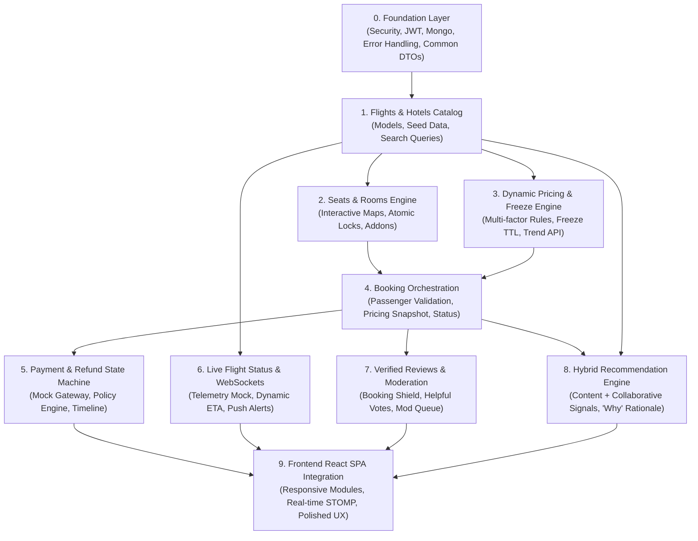

# SmartTravel Platform — Master Development Plan & Implementation Roadmap

> **Document Version:** 1.0.0-PROD-PLAN  
> **Status:** Ready for Staged Execution  
> **Target Audience:** Engineering Team, Tech Leads, QA Leads, Project Stakeholders  

---

## 1. Feature Dependency Graph & Execution Order

To ensure zero blocking bottlenecks and maintain high velocity with test-driven guarantees, the project follows a strict DAG (Directed Acyclic Graph) of dependencies:



---

## 2. Staged Implementation Roadmap

```
┌────────────────────────────────────────────────────────────────────────┐
│                        STAGED ROADMAP OVERVIEW                         │
├──────────────┬──────────────┬──────────────┬──────────────┬────────────┤
│   Phase 1    │   Phase 2    │   Phase 3    │   Phase 4    │  Phase 5   │
│  Foundation  │  Catalogs &  │  Pricing &   │ Real-time &  │ Reviews &  │
│  & Security  │  Inventory   │   Bookings   │   Refunds    │    Recs    │
└──────────────┴──────────────┴──────────────┴──────────────┴────────────┘
```

### Phase 1: Enterprise Foundation & Security Layer
- **Deliverables:**
  - Common package infrastructure: `ApiResponse<T>`, `ErrorResponse`, `GlobalExceptionHandler`.
  - Spring Security 6 config, BCrypt password encoder, stateless JWT authentication filter (`JwtAuthenticationFilter`), and `JwtTokenProvider`.
  - MongoDB connection pooling, auditing (`@EnableMongoAuditing`), and base entity lifecycle listeners.
  - OpenAPI 3.0 documentation configuration with JWT bearer security scheme.
  - Initial test harness with Embedded MongoDB / Testcontainers support.
- **Verification Criteria:**
  - Auth test suite passing (registration, login, invalid token rejection, expired token rejection, role assignment).

### Phase 2: Domain Catalogs & Inventory (Seats & Rooms)
- **Deliverables:**
  - Flight catalog with airport models, flight schedules, aircraft configuration.
  - Hotel catalog with GeoJSON coordinates, amenity tags, star ratings, and room types (`STANDARD`, `DELUXE`, `SUITE`).
  - Flight Seat Map engine: Aircraft seat matrix generator with seat classification (`WINDOW`, `AISLE`, `EXTRA_LEGROOM`) and dynamic addon fees.
  - Atomic seat locking mechanism (optimistic concurrency with 10-minute TTL).
  - User travel preferences API (preferred seat type, preferred room category).
- **Verification Criteria:**
  - Seat concurrency test: Two concurrent requests attempting to lock the same seat must result in exactly 1 success and 1 `409 Conflict`.

### Phase 3: Dynamic Pricing Engine & Price Freeze
- **Deliverables:**
  - Dynamic Pricing Engine: Configurable rule evaluator supporting Demand, Holiday, Seasonal, Proximity, and Availability multipliers.
  - Transparent price breakdown calculation service (`Base Price` + individual factor line items).
  - Price Freeze Engine: Cryptographic token generation, 30-minute lock guarantee, and automatic background expiration reaper.
  - Historical price tracking service and price trend graph API for charting.
- **Verification Criteria:**
  - Unit tests verifying multi-factor price formulas and freeze token verification during checkout.

### Phase 4: Booking Orchestration, Cancellations & Refund State Machine
- **Deliverables:**
  - Booking service with passenger detail validation, frozen price snapshot binding, and atomic seat/room allocation.
  - Pluggable Mock Payment Gateway adapter simulating payment authorization, webhooks, and settlement.
  - Configurable Cancellation Policy Engine evaluating departure/check-in proximity tiers (e.g. >48h = 90% refund, 24-48h = 50%, <24h = 0%).
  - Refund State Machine (`PENDING` ➔ `PROCESSING` ➔ `COMPLETED` / `FAILED`) with immutable timeline event logging.
  - Cancellation preview API allowing users to inspect cancellation charges before committing.
- **Verification Criteria:**
  - Refund policy test suite checking all time boundary edge cases (47h 59m vs 48h 01m) and refund ledger accuracy.

### Phase 5: Real-Time Flight Status & Telemetry Simulation
- **Deliverables:**
  - Mock Flight Status Engine simulating real-time telemetry events (`ON_TIME`, `DELAYED`, `BOARDING`, `DEPARTED`, `ARRIVED`, `CANCELLED`).
  - Dynamic ETA recalculation service handling revised departures and delay reasons.
  - Spring WebSocket configuration with STOMP message broker (`/topic/flights/{flightNumber}/status`) and user alerts (`/user/queue/notifications`).
  - Multi-flight user tracking subscription service.
- **Verification Criteria:**
  - Integration test verifying that a status transition generates a STOMP broadcast payload with accurate revised ETA.

### Phase 6: Verified Reviews, Hybrid Recommendations & Modern UI
- **Deliverables:**
  - Verified Review System: Gatekeeper ensuring only users with completed bookings can review flights/hotels.
  - Moderation queue, helpful vote aggregator, report flagging, and reply threads.
  - Hybrid Recommendation Engine: Combining content-based filtering with collaborative signals, generating transparent "Why this recommendation?" rationales.
  - Explicit recommendation feedback loop (`HELPFUL` vs `IRRELEVANT`).
  - Full React + TypeScript SPA integration with modern glassmorphic theme, interactive seat map, flight radar, pricing charts, and refund timelines.
- **Verification Criteria:**
  - End-to-end integration tests for all 6 mandatory features and frontend build validation.

---

## 3. Comprehensive Testing Strategy

| Test Level | Scope | Tooling | Target Coverage |
|---|---|---|---|
| **Unit Tests** | Pricing formula calculators, policy tier evaluators, recommendation scorers, token encoders | JUnit 5, Mockito, AssertJ | > 85% Business Logic |
| **Slice Tests** | REST Controllers, validation annotations, security role authorization (`@PreAuthorize`) | `@WebMvcTest`, Spring Security Test | 100% Endpoints |
| **Integration Tests** | MongoDB document persistence, compound index queries, atomic transactions | `@SpringBootTest`, Testcontainers / Flapdoodle Mongo | Core Repositories & Services |
| **Concurrency Tests** | Simultaneous seat booking, race conditions on price freeze locks | Java `ExecutorService`, `CountDownLatch` | Critical Concurrency Paths |
| **Real-time Tests** | WebSocket STOMP subscription & message delivery | `StompSessionHandler`, SockJS Client | Live Status Pipeline |

---

## 4. Edge Cases & Risk Mitigation Matrix

| Category | Potential Risk / Edge Case | Architectural Mitigation Strategy |
|---|---|---|
| **Dynamic Pricing** | Price changes while user is entering card details | Price Freeze token guarantees price for 30 minutes; regular checkout snapshots calculated price with 15-minute checkout lock. |
| **Seat Allocation** | Two users click the same extra-legroom seat at the exact same millisecond | Atomic MongoDB `$set` with condition `status: 'AVAILABLE'` via `findAndModify`. Exactly one succeeds; the second receives a descriptive `409 Conflict`. |
| **Refunds** | Network failure or gateway timeout during refund processing | Refund State Machine transitions to `PROCESSING` with retry idempotency key. Failure transitions to `FAILED` with admin alert for manual or automated retry. |
| **Telemetry Simulation** | Mock flight generator creates unrealistic schedule conflicts (e.g. arrival before departure) | Strict domain invariant validation: `estimatedArrival = revisedDeparture.plus(durationMinutes)`. |
| **Review Integrity** | Malicious users post spam reviews for hotels they never stayed at | Hard gatekeeper database check asserting `BookingRepository.existsByUserIdAndTargetIdAndStatus(userId, targetId, COMPLETED)`. |
| **Real-time Scaling** | Thousands of connected clients causing socket connection exhaustion | Lightweight STOMP in-memory broker with keep-alive heartbeats and automatic disconnect on inactive sessions. |

---

## 5. Deployment & Execution Plan

### Local Development Environment
- **Backend:** `d:/makemytrip/backend`
  - Command: `./mvnw spring-boot:run` (Port `8080`)
  - Swagger UI: `http://localhost:8080/swagger-ui.html`
- **Frontend:** `d:/makemytrip/frontend`
  - Command: `npm run dev` (Port `5173`)
  - Proxy configured to automatically forward `/api` and `/ws` to `http://localhost:8080`.

---
*End of Master Development Plan.*
