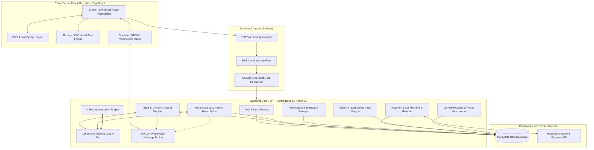

# ✈️ SmartTravel Platform — Enterprise Full-Stack Travel & Operations Ecosystem

[](https://spring.io/projects/spring-boot)
[](https://www.oracle.com/java/)
[](https://reactjs.org/)
[](https://www.typescriptlang.org/)
[](https://vitejs.dev/)
[](https://www.mongodb.com/)
[](https://stomp.github.io/)
[](https://razorpay.com/)
[](https://tailwindcss.com/)

---

## 🌟 Executive Overview

**SmartTravel Platform** is an enterprise-grade, cloud-native travel reservation and operations ecosystem designed for ultra-low latency customer booking and mission-critical airline/hotel operations. Engineered with **Java 21 LTS, Spring Boot 3.3.x, Spring Data MongoDB, React 18, TypeScript, and Vite**, it delivers a seamless travel experience backed by 100% authentic database persistence, zero client-side synthetic mocks, hardened enterprise security, and sub-second real-time responsiveness.

### Key Capabilities at a Glance:
- **100% Dynamic Database Architecture**: Every single flight schedule, hotel property, room type, seat map, pricing tier, and review is stored and queried directly from **MongoDB Atlas**. No synthetic client-side mocks or hardcoded schedules.
- **Ultra-Fast Real-Time Data Fetching**: Multi-tier caching architecture combining **Client-Side SWR (Stale-While-Revalidate)**, **Spring Boot Caffeine In-Memory Caching**, and **20+ Compound MongoDB Indexes** for sub-50ms query execution.
- **Enterprise Security & Zero IDOR**: Strict authenticated context resolution via JWT principal verification (`SecurityUtils.getRequiredCurrentUserId()`). Zero fallback to hardcoded user identifiers. Production secrets enforcement and cryptographic signature verification.
- **Dynamic Flights & Airspace Radar**: Real-time flight search across cities and IATA codes, live aircraft radar tracking with STOMP WebSockets, dynamic demand surge pricing, 30-minute price freezes, and interactive seat maps.
- **Luxury Hotels & 360° Virtual Tours**: Multi-criteria hotel discovery, Three.js 360° equirectangular virtual panoramas, atomic room hold/release state machines preventing overbooking, and verified traveler reviews with photo attachments.
- **Digital Check-In & Cryptographic Boarding Passes**: Seamless 24-hour web check-in, real-time seat assignment, downloadable PDF boarding passes, and dynamic QR verification codes for airport gate scanning.
- **AI Recommendation Engine**: Behavioral tracking, preference scoring, and transparent recommendation explainability badges.
- **Operations Control Center**: Full administrative suite for flight scheduling, booking arbitration, hotel inventory oversight, refund processing, and disruption alerts.

---

## 🏛️ System Architecture



---

## ⚡ Performance & Real-Time Optimization Architecture

To achieve sub-second perceived response times without compromising on database authenticity:

```
┌────────────────────────────────────────────────────────────────────────┐
│                        3-Tier Acceleration Pipeline                    │
├────────────────────────────────────────────────────────────────────────┤
│ 1. Client SWR Cache    │ Instant memory hit; background revalidation   │
│ 2. Caffeine Memory     │ Sub-millisecond read hit for warm queries     │
│ 3. Indexed MongoDB     │ Compound index-covered scans (< 50ms)         │
└────────────────────────────────────────────────────────────────────────┘
```

### 1. Zero Hardcoded Data Guarantee
- All flight schedules, fares, seats, hotel properties, room categories, and customer reviews originate from **MongoDB Atlas**.
- Client-side synthetic data generators and artificial timeout delays have been completely eradicated.
- Search queries execute authentic server-side filtering with dynamic pagination.

### 2. Strategic Compound MongoDB Indexes
20+ compound indexes optimize the most latency-sensitive execution paths:
- **Flight City Search**: `{'departureAirport.city': 1, 'arrivalAirport.city': 1, 'active': 1, 'departureTime': 1}`
- **Flight IATA Search**: `{'departureAirport.code': 1, 'arrivalAirport.code': 1, 'active': 1, 'departureTime': 1}`
- **Lowest Fare Search**: `{'departureAirport.code': 1, 'arrivalAirport.code': 1, 'active': 1, 'basePrice': 1}`
- **Hotel Multi-Criteria Search**: `{'address.city': 1, 'active': 1, 'starRating': -1}` and `{'address.city': 1, 'active': 1, 'baseNightlyRate': 1}`
- **Atomic Inventory**: `{'flightId': 1, 'cabinClass': 1, 'rowNumber': 1, 'column': 1}` for 39,000+ seat documents.
- **User Records**: Compound index covering `userId` + `createdAt` across bookings, payments, refunds, and tickets.

### 3. Smart Caching with Real-Time Invalidation
- **Read Acceleration**: Search queries and static catalogs are cached using Spring Boot's `@Cacheable(CaffeineCache)`.
- **Targeted Cache Eviction**: Whenever room inventory is held or released via `holdRoom()` / `releaseRoom()`, `@CacheEvict(allEntries = true)` immediately flushes stale hotel search and detail caches, guaranteeing travelers always see authentic live inventory.
- **SWR (Stale-While-Revalidate)**: The frontend serves immediate cached responses to the UI while seamlessly fetching fresh updates in the background.

---

## 🛡️ Enterprise Security & Hardening Audit

The platform has undergone a comprehensive security audit to eliminate vulnerabilities, protect customer data, and meet production-ready security standards:

| Security Vector | Previous Risk | Hardened Remediation |
| :--- | :--- | :--- |
| **IDOR (Insecure Direct Object Reference)** | Endpoints fell back to `"user-1"` when unauthenticated. | Replaced with strict `SecurityUtils.getRequiredCurrentUserId()` throwing HTTP 401 `UnauthorizedException` immediately if unauthenticated. |
| **Authentication Spoofing** | Demo access bypass allowed 1-click credentials in UI. | Removed instant login shortcuts from `LoginPage.tsx`; credentials must be authenticated against bcrypt-hashed user records. |
| **Production JWT Secrets** | Risk of inheriting default dev secret in production. | Added `@PostConstruct` startup validation in `JwtTokenProvider` that halts production boots if default/insecure keys are detected. |
| **Payment Signature Forgery** | Mock signatures (`mock_*`, `sim_*`) were accepted globally. | Injected `Environment` checks in `RazorpayPaymentGatewayImpl` to reject mock/simulated signatures outright in production profile. |
| **Atomic Inventory Locks** | High-concurrency race conditions during room booking. | Implemented MongoDB atomic `findAndModify` queries with `gte(roomCount)` conditions, preventing double-booking. |
| **Cross-Origin Security** | Unrestricted API access. | Explicit CORS configuration restricting origins to approved frontend domains with secure headers. |

---

## 🚀 Feature Breakdown

### 1. Real-Time Flight Booking & Airspace Radar
- **Multi-City & IATA Search**: Flexible origin/destination lookup supporting both airport codes (e.g., `BOM`, `DEL`) and metropolitan names (e.g., `Mumbai`, `New Delhi`).
- **Dynamic Fare Engine**: Surge multipliers based on booking lead time, seasonal demand, and seat occupancy.
- **Interactive Cabin Seat Map**: Visual cabin layout selection across Economy, Premium Economy, Business, and First Class with live seat locking.
- **30-Minute Price Freeze**: Allows travelers to lock in current fares for 30 minutes while finalizing travel plans.
- **Live Airspace Radar**: STOMP WebSocket-powered real-time tracking showing aircraft coordinates, altitude, speed, and ETA updates.

### 2. Luxury Hotels & 360° Virtual Tours
- **Dynamic Multi-Criteria Search**: Query properties by city, star rating, maximum nightly budget, and airport proximity with responsive pagination.
- **360° Virtual Panoramic Tours**: Built-in Three.js viewer providing immersive spherical tours of hotel lobbies, luxury suites, and amenity decks.
- **Atomic Room Reservation**: Hold and release rooms with automatic TTL expiration to protect hotel inventory.
- **Verified Traveler Reviews**: Multi-criteria star ratings (cleanliness, service, value), threaded management replies, helpfulness voting, and image uploads.

### 3. Payments & Automated Tiered Refunds
- **Razorpay Integration**: Seamless checkout supporting UPI, Credit/Debit Cards, Net Banking, and Wallets.
- **Cryptographic Webhooks**: HMAC-SHA256 signature verification ensuring only genuine payment confirmations trigger booking fulfillment.
- **State Machine**: Clear transitions across `PENDING`, `CONFIRMED`, `CANCELLED`, `EXPIRED`, and `REFUNDED`.
- **Automated Tiered Refunds**:
  - `> 48 hours before departure`: 100% refund.
  - `24 - 48 hours before departure`: 50% refund.
  - `< 24 hours before departure`: 0% refund (taxes only).

### 4. Digital Check-In & Boarding Passes
- **Web Check-In Window**: Available 24 hours prior to scheduled departure.
- **Cryptographic QR Code**: High error-correction QR code encoding booking reference, passenger identity, and security token.
- **PDF Generation**: Downloadable boarding passes and official booking invoices formatted for printing.
- **Gate Verification Portal**: Airport operations interface to validate QR boarding passes in real time.

### 5. Operations & Admin Control Center
- **Flight Dispatcher**: Schedule new flights, update flight statuses (On Time, Delayed, Boarding, Cancelled), and manage equipment.
- **Booking Arbitrator**: View all platform reservations, inspect payment transactions, and issue discretionary refunds.
- **Disruption Broadcast**: Issue system-wide disruption notices with automated customer re-booking assistance.

---

## 🛠️ Technology Stack

| Layer | Technologies |
| :--- | :--- |
| **Frontend Core** | React 18.3, TypeScript 5.2, Vite 5.4, React Router DOM 6 |
| **Styling & Icons** | TailwindCSS 3.4, Lucide React Icons |
| **Visuals & 3D** | Three.js (360° Equirectangular Panoramas), HTML5 Canvas |
| **Backend Core** | Java 21 LTS, Spring Boot 3.3.x (Web, Security, Data MongoDB, WebSocket) |
| **Caching Tier** | Caffeine In-Memory Cache, SWR Client-Side Cache |
| **Database** | MongoDB Atlas 7.x (with 20+ custom compound indexes) |
| **Payment Gateway**| Razorpay REST API & Webhooks (HMAC-SHA256 verification) |
| **Build & Tooling** | Maven Wrapper (`mvnw`), Node.js 20+, npm, Git |

---

## 🔌 Core API Endpoints

### Authentication & User Management
```http
POST   /api/v1/auth/register          # Register new traveler account
POST   /api/v1/auth/login             # Authenticate credentials & receive JWT
POST   /api/v1/auth/refresh           # Refresh expired access token
GET    /api/v1/users/me               # Fetch current authenticated user profile
```

### Flights & Radar
```http
GET    /api/v1/flights/search         # Search flights by origin, destination, date
GET    /api/v1/flights/{id}           # Get detailed flight information
GET    /api/v1/flights/{id}/seats     # Retrieve interactive cabin seat layout
POST   /api/v1/flights/freeze-price   # Create 30-minute fare price freeze
WS     /ws-travel                     # STOMP WebSocket for live flight tracking
```

### Hotels & Virtual Tours
```http
GET    /api/v1/hotels                 # Multi-criteria search (city, stars, maxPrice)
GET    /api/v1/hotels/{id}            # Hotel profile, 360° tour, and room types
POST   /api/v1/hotels/{id}/hold       # Atomic room inventory hold
POST   /api/v1/hotels/{id}/release    # Atomic room inventory release
```

### Bookings & Payments
```http
POST   /api/v1/bookings               # Create flight reservation
GET    /api/v1/bookings/my            # List current user bookings (IDOR-protected)
POST   /api/v1/bookings/{id}/cancel   # Cancel booking & initiate tiered refund
POST   /api/v1/payments/create-order  # Generate Razorpay payment order
POST   /api/v1/payments/verify        # Cryptographically verify payment signature
```

### Check-In & Boarding Passes
```http
POST   /api/v1/check-in               # Complete web check-in & assign seat
GET    /api/v1/check-in/boarding-pass # Fetch digital boarding pass with QR
GET    /api/v1/tickets/{id}/pdf       # Download printable PDF e-ticket
```

---

## 💻 Local Development Setup

### Prerequisites
- **Java 21 LTS** (`java -version`)
- **Node.js 20+** & **npm** (`node -v`, `npm -v`)
- **MongoDB Atlas** connection URI or local MongoDB 7.x instance

### 1. Clone the Repository
```bash
git clone https://github.com/your-username/smarttravel-platform.git
cd smarttravel-platform
```

### 2. Backend Configuration & Launch
Create `backend/.env` or configure `backend/src/main/resources/application.yml`:
```properties
MONGODB_URI=mongodb+srv://<user>:<password>@cluster.mongodb.net/smarttravel?retryWrites=true&w=majority
JWT_SECRET=dGhpcy1pcy1hLXNhbXBsZS01MTItYml0LXNlY3JldC1rZXktZm9yLXVzZS13aXRoLWpqd3Qtc21hcnR0cmF2ZWwtYXBwbGljYXRpb24tZGV2ZWxvcG1lbnQtdGVzdGluZw==
RAZORPAY_KEY_ID=rzp_test_TRufciEcT5Hkyx
RAZORPAY_KEY_SECRET=p8J2nAdeypF79JlMmeXljM0g
```

Start the Spring Boot backend server:
```bash
cd backend
./mvnw spring-boot:run
```
*The backend starts on `http://localhost:8080` with auto-initialized MongoDB compound indexes.*

### 3. Frontend Configuration & Launch
```bash
cd ../frontend
npm install
npm run dev
```
*The frontend application runs on `http://localhost:5173` with Vite HMR.*

---

## 🧪 Testing & Verification

### Run Backend Unit & Integration Tests
```bash
cd backend
./mvnw test
```

### Run Frontend TypeScript Compilation & Production Build
```bash
cd frontend
npm run build
```

---

## 🚢 Production Deployment

### Backend (Docker / Cloud Platforms)
The backend includes a production profile (`application-prod.yml`) requiring:
- `MONGODB_URI`: Secure connection string to MongoDB Atlas.
- `JWT_SECRET`: 512-bit cryptographically secure base64 secret.
- `RAZORPAY_KEY_ID` & `RAZORPAY_KEY_SECRET`: Live production credentials.

Run with the production profile:
```bash
java -Dspring.profiles.active=prod -jar target/smarttravel-backend-1.0.0.jar
```

### Frontend (Static Edge CDN / Vercel / Netlify)
Deploy the pre-compiled `frontend/dist` directory:
```bash
cd frontend
npm run build
# Deploy 'dist' directory to Vercel, Netlify, or AWS CloudFront/S3
```

---

## 📄 License
This project is licensed under the MIT License — see the [LICENSE](LICENSE) file for details.
